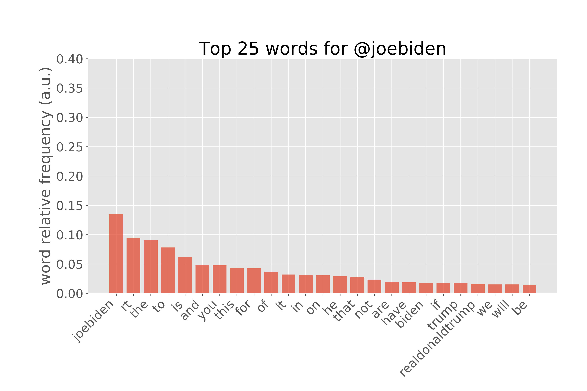
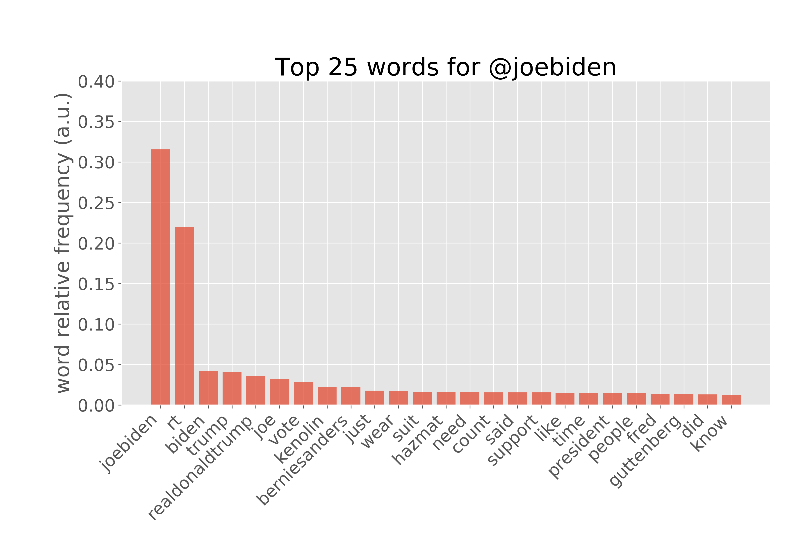
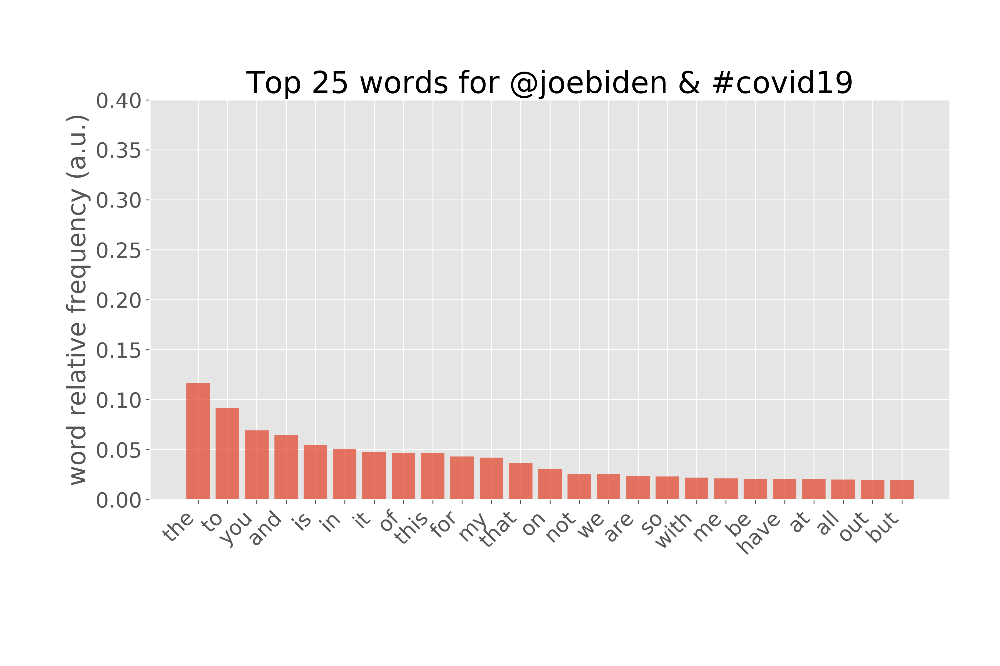
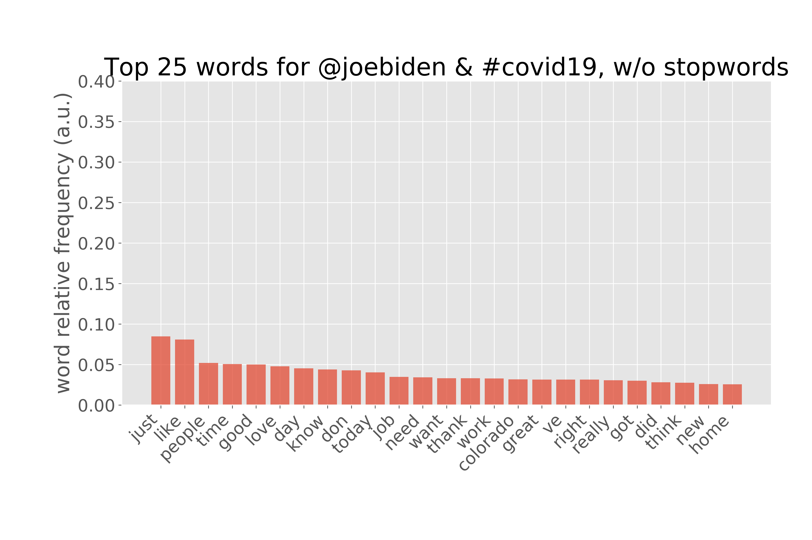
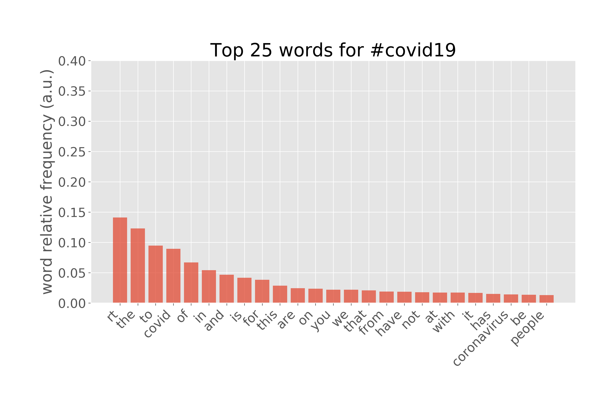
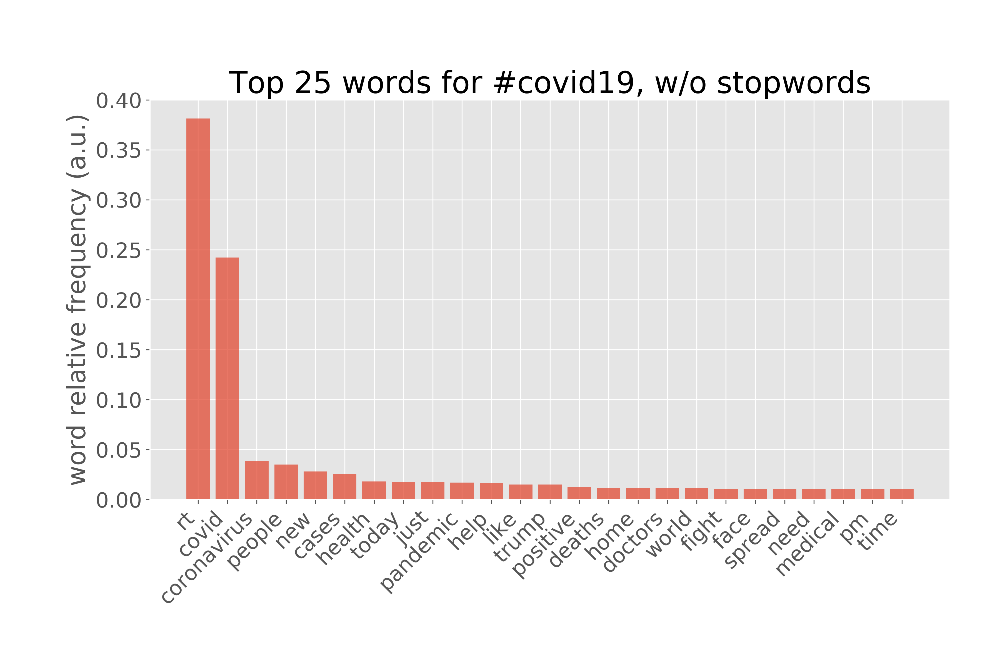
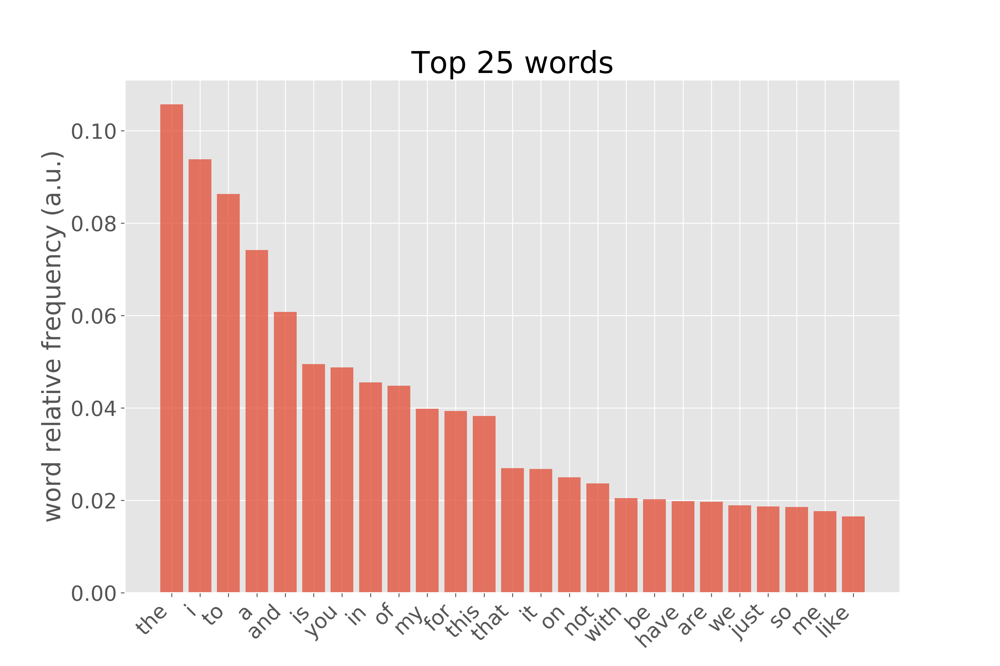
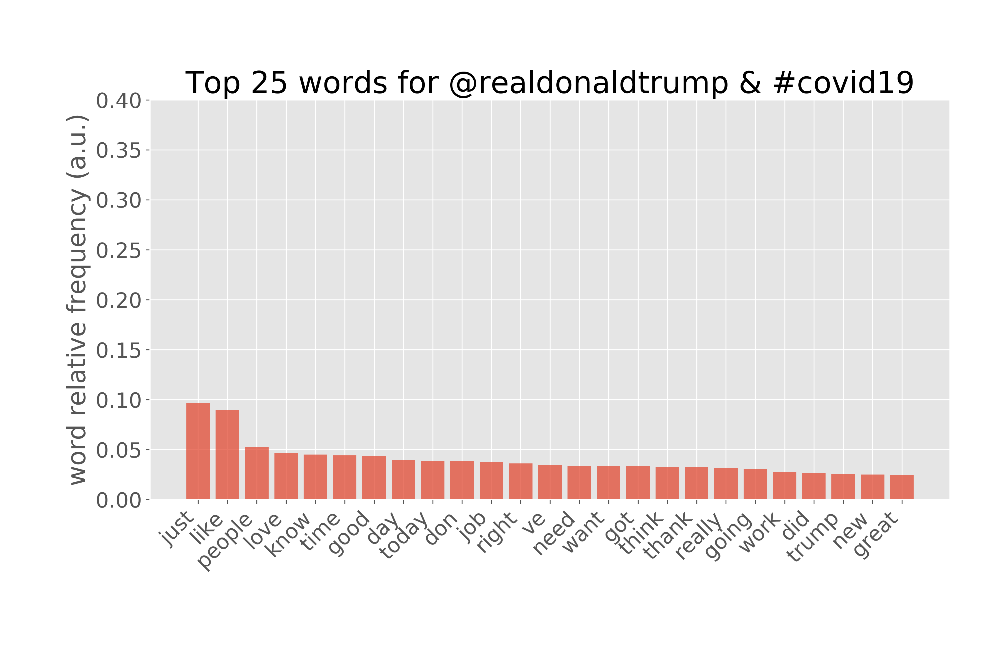
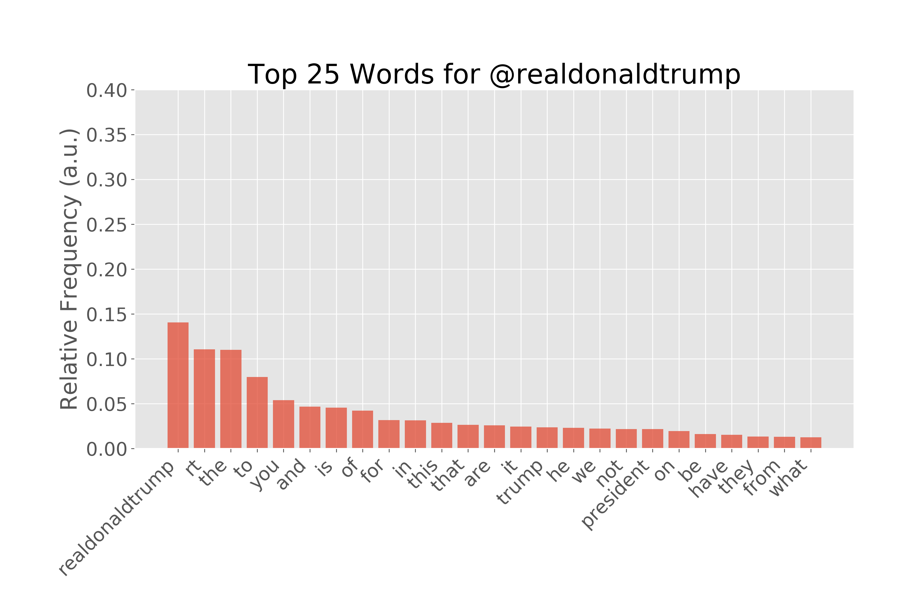
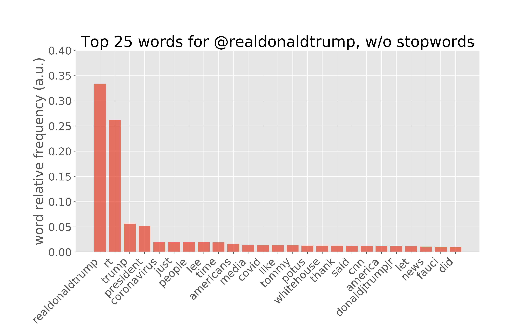

# Sensitivity Analysis of VADER Sentiment Analyzer

    

## Motivation
VADER (Valence Aware Dictionary and sEntiment Reader) is a rule-based sentiment analysis tool that is commonly used for social-media sentiment analysis. The meat of VADER is provided by two main resources: the VADER sentiment lexicon and the rule-based sentiment analysis engine.

According to the development [github page](https://github.com/cjhutto/vaderSentiment), the VADER lexicon has been created (and validated) by 10 independent humans who **manually** assign the sentiment value to each word using a [wisdom-of-the-crowd (WotC)](http://comp.social.gatech.edu/papers/icwsm14.vader.hutto.pdf) approach, described briefly below:

>Sentiment ratings from 10 independent human raters (all pre-screened, trained, and quality checked for optimal inter-rater reliability). Over 9,000 token features were rated on a scale from "[–4] Extremely Negative" to "[4] Extremely Positive", with allowance for "[0] Neutral (or Neither, N/A)".  We kept every lexical feature that had a non-zero mean rating, and whose standard deviation was less than 2.5 as determined by the aggregate of those ten independent raters.  This left us with just over 7,500 lexical features with validated valence scores that indicated both the sentiment polarity (positive/negative), and the sentiment intensity on a scale from –4 to +4. For example, the word "okay" has a positive valence of 0.9, "good" is 1.9, and "great" is 3.1, whereas "horrible" is –2.5, the frowning emoticon :( is –2.2, and "sucks" and it's slang derivative "sux" are both –1.5.

Manually assigning (and validating) sentiment for the lexicon enables the sentiment of commonly used emoticons, acronyms and slag words to be accurately determined. 

On top of the lexicon, VADER also uses a rule-based sentiment analysis engine. The idea behin this engine is to encorporate **word-order sensitive relationships** and boils down to these five rules:

1. Punctuation increased the magnitude of the intensity without modyfying the semantic orientation.

        "I'm bored of being stuck at home!!" vs. "I'm bored of being stuck at home"

2. Likewise, capitalization increases the magnitude of the intensity without affecting the semantic orientation.

        "I'm bored of being STUCK AT HOME" vs. "I'm bored of being stuck at home"

3. Degree adverbs either negatively or positively impact sentiment intensity.

        "I'm incredibly bored of being stuck at home" vs. "I'm bored of being stuck at home"

4. The conjunction 'but' signals a shift in sentiment polarity, with the sentiment of the text following the conjunction being dominant.

        "I'm bored of being stuck at home, but my house is clean"

5. The tri-gram preceding a sentiment-laden lexical feature will catch most cases of negation flips in polarity.

        "My house isn't really all that clean"

With both of these attributes, VADER claims to perform excellent on predicting sentiment with social media style lexical documents. I wanted to see if this is the case and analyze the sensitivity of the VADER algorithm to text-preprocessing.

## The Dataset 

Outliine:

1. Intro - done
2. Explaining the dataset and accumulation method
3. Explain stack (AWS -> Spark -> Pandas)
4. Initial look at data: Example tweets
5. initial word bar chart of word frequency
6. Explain data cleaning methods (treatments: emoji/non-emoji, stop-words/no stop-words)
7. VADER sentiment example: positive, neutral, negative
8. MVP: for CO: Distribution of sentiments for each search term and each treatment combo
    
    - 2 graphs (emoji/non-emoji), (stopwords/no): dist of means using bootstraps

9. MVP+: do 8 for OR/AR
10. Conclusion
11. references

    
    

    
    

    
    

    
    

    
    

# References:
1. [VADER github](https://github.com/cjhutto/vaderSentiment)
2. [VADER research publication](http://comp.social.gatech.edu/papers/icwsm14.vader.hutto.pdf)