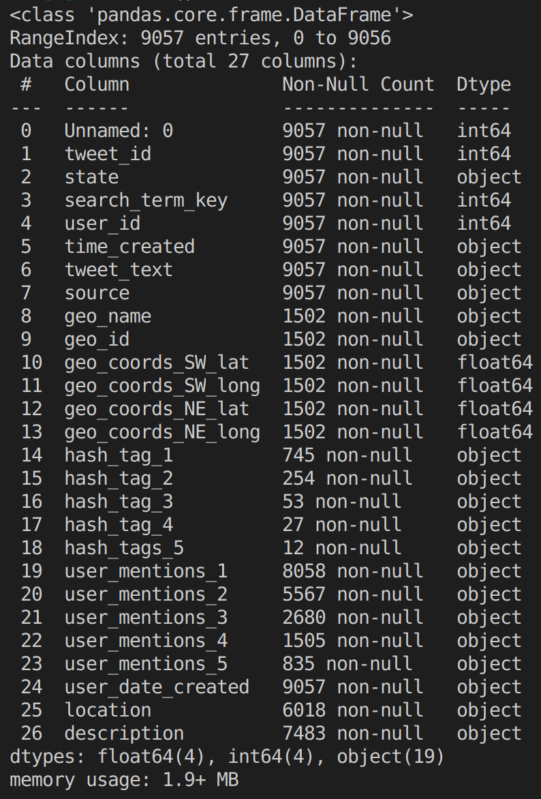
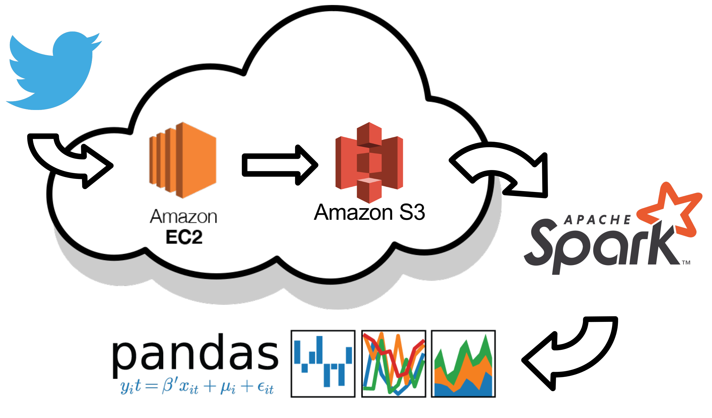
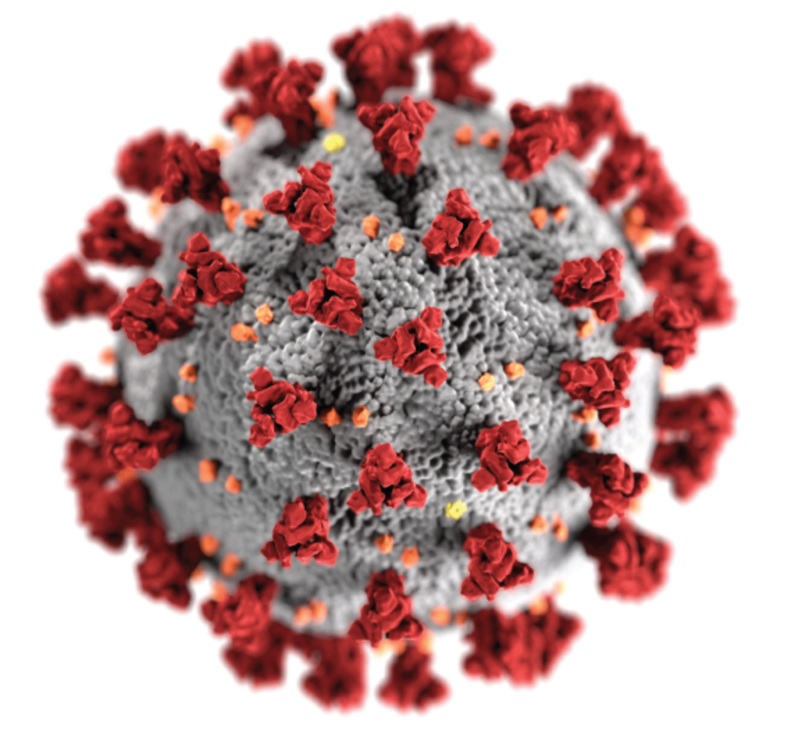
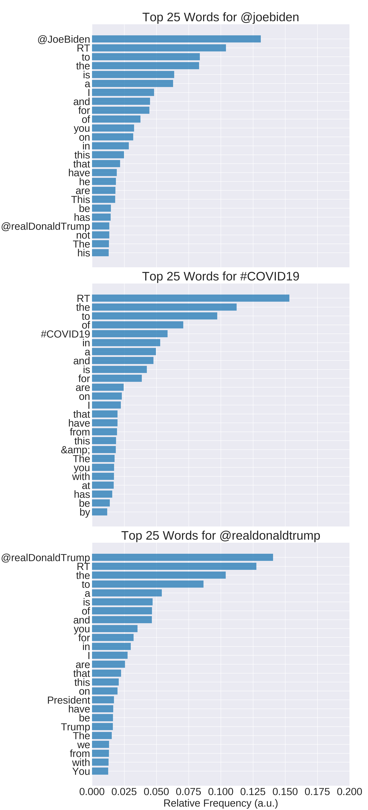
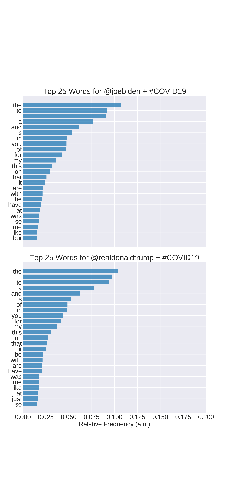
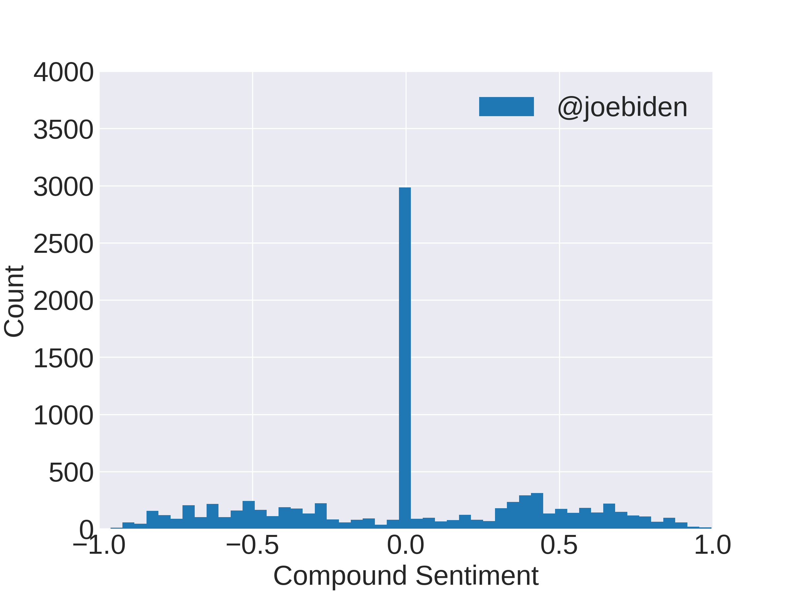
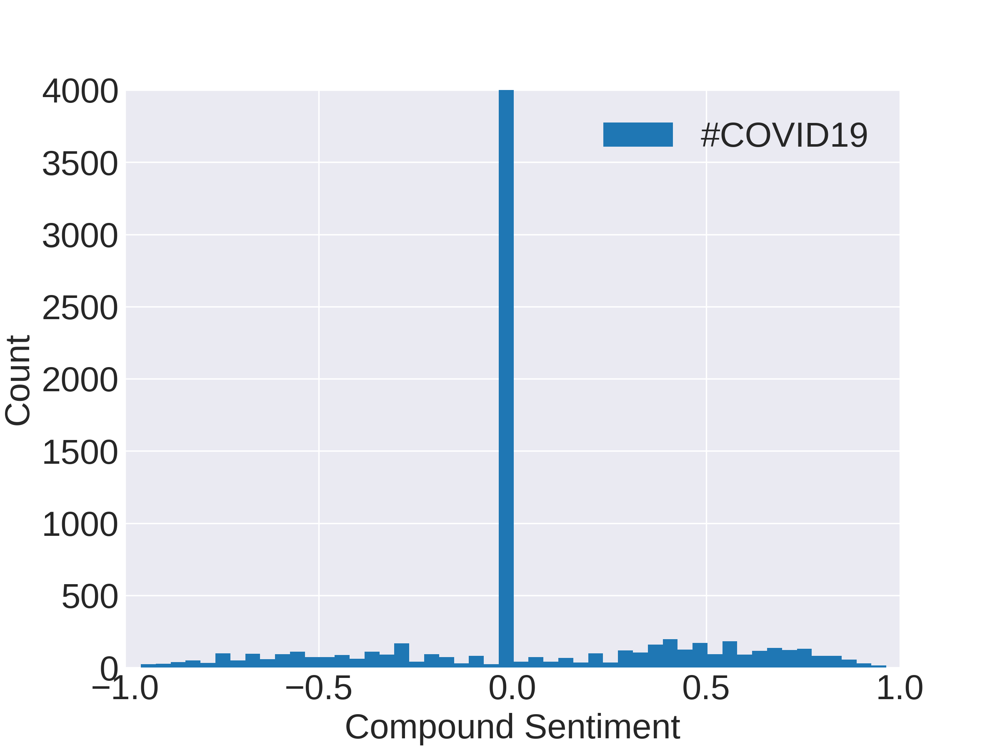
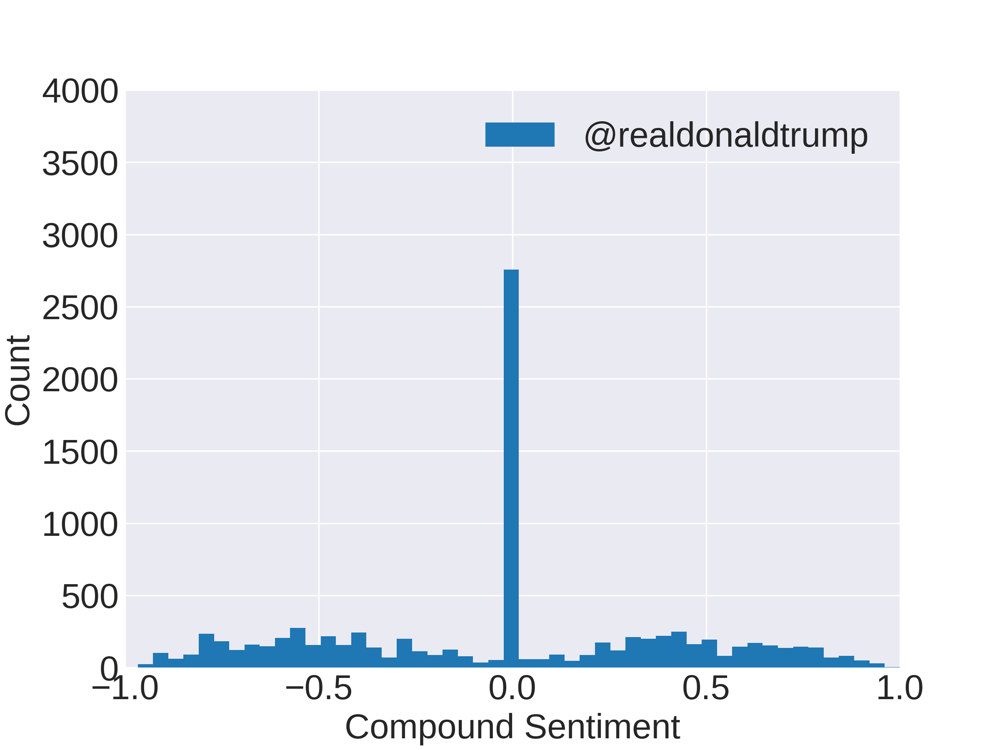
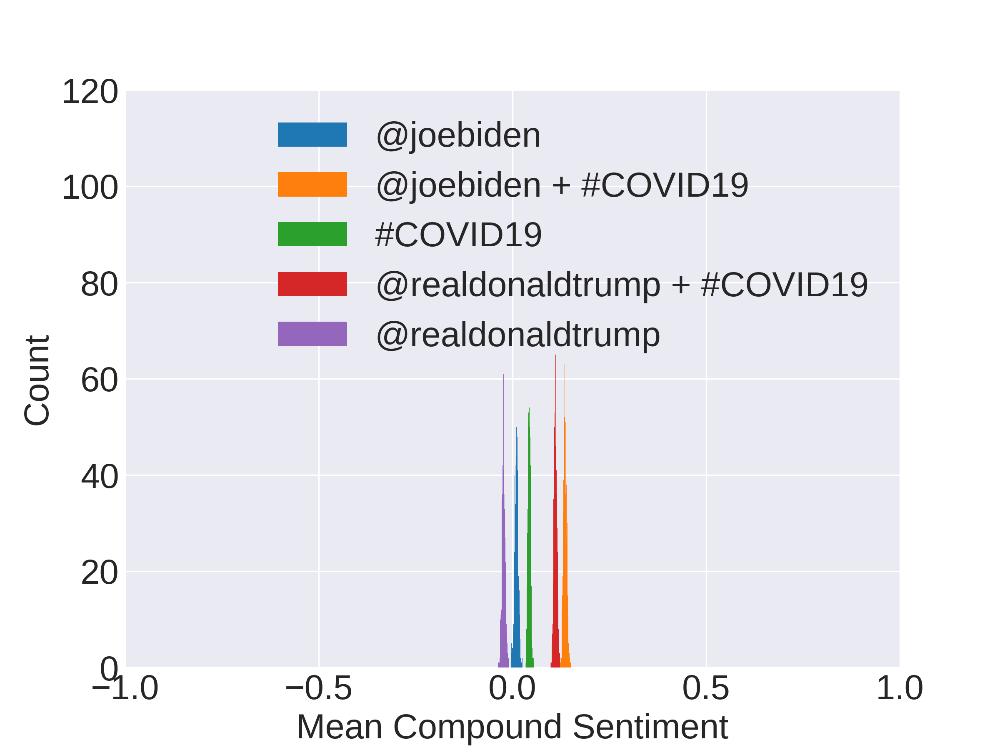
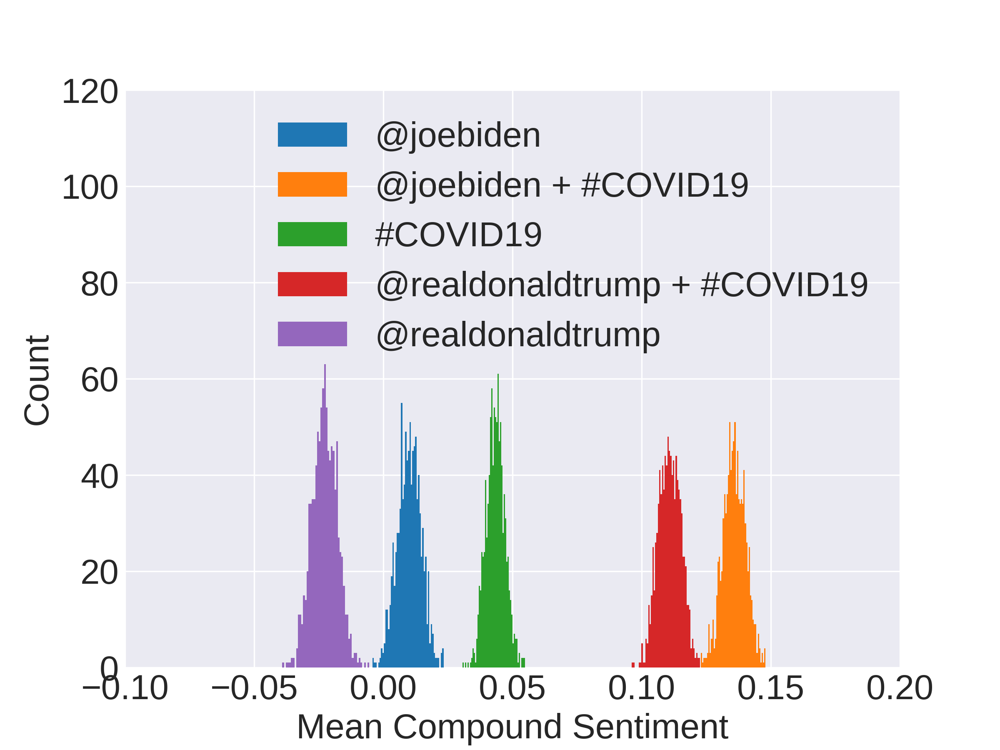

# Sensitivity Analysis of VADER Sentiment Analyzer

<p align="center">
    
</p>


# Table of Contents

1. [Motivation](#Motivation)
2. [The Dataset](#The-Dataset)


# Motivation
VADER (Valence Aware Dictionary and sEntiment Reader) is a rule-based sentiment analysis tool that is commonly used for social-media sentiment analysis. The meat of VADER is provided by two main resources: the VADER sentiment lexicon and the rule-based sentiment analysis engine.

According to the development [github page](https://github.com/cjhutto/vaderSentiment), the VADER lexicon has been created (and validated) by 10 independent humans who **manually** assign the sentiment value to each word using a [wisdom-of-the-crowd (WotC)](http://comp.social.gatech.edu/papers/icwsm14.vader.hutto.pdf) approach, described briefly below:

>Sentiment ratings from 10 independent human raters (all pre-screened, trained, and quality checked for optimal inter-rater reliability). Over 9,000 token features were rated on a scale from "[–4] Extremely Negative" to "[4] Extremely Positive", with allowance for "[0] Neutral (or Neither, N/A)".  We kept every lexical feature that had a non-zero mean rating, and whose standard deviation was less than 2.5 as determined by the aggregate of those ten independent raters.  This left us with just over 7,500 lexical features with validated valence scores that indicated both the sentiment polarity (positive/negative), and the sentiment intensity on a scale from –4 to +4. For example, the word "okay" has a positive valence of 0.9, "good" is 1.9, and "great" is 3.1, whereas "horrible" is –2.5, the frowning emoticon :( is –2.2, and "sucks" and it's slang derivative "sux" are both –1.5.

Manually assigning (and validating) sentiment for the lexicon enables the sentiment of commonly used emoticons, acronyms and slag words to be accurately determined. 

On top of the lexicon, VADER also uses a rule-based sentiment analysis engine. The idea behind this engine is to encorporate **word-order sensitive relationships** that boil down to these five rules:

1. Punctuation increases the magnitude of the intensity without modyfying the semantic orientation.

        "I'm bored of being stuck at home!!" vs. "I'm bored of being stuck at home"

2. Likewise, capitalization increases the magnitude of the intensity without affecting the semantic orientation.

        "I'm bored of being STUCK AT HOME" vs. "I'm bored of being stuck at home"

3. Degree adverbs either negatively or positively impact sentiment intensity.

        "I'm incredibly bored of being stuck at home" vs. "I'm bored of being stuck at home"

4. The conjunction 'but' signals a shift in sentiment polarity, with the sentiment of the text following the conjunction being dominant.

        "I'm bored of being stuck at home, but my house is clean"

5. The tri-gram preceding a sentiment-laden lexical feature will catch most cases of negation flips in polarity.

        "My house isn't really all that clean"

With both of these attributes, VADER claims to perform excellent on predicting sentiment with social media style corpora. With this project, I wanted to investigate this claim by analyzing the sensitivity of the VADER algorithm to text pre-processing. Text pre-processing is a procedure, or series of procedures, commonly performed in natural language processing (NLP) to improve the performance of machine learning (ML) algorithms. Thus, a deeper understanding of the effect of text pre-preprocessing on VADER sentiment analysis could help future data scientists develop more effective ML algorithms. 

# The Dataset 

I wanted to simulate a data science project from conceptualization to data wrangling through feature engineering. Since the VADER algorithm was trained to perform sentiment analysis on social media documents, I decided to collect Twitter data, tweets, to form my dataset.

## Tweet Collection

The topic I chose to investigate is in the back of everyone's mind at the moment; the COVID-19 pandemic. Being a national emergency, I figured people on twitter would express emotion towards their political leaders concerning the topic. So, tweets were collected using Twitter's free API and the [Tweepy](http://www.tweepy.org/) python library in three distinct geopolitical regions in the contigous United States: Oregon, Colorado, and Arkansas. These regions were chosen via their representation in the U.S. Senate; Oregon - Liberal, Colorado - Bipartisan, and Arkansas - Conservative. Keeping with the political focus, tweets were streamed with the following keyword combinations:

1. @joebiden
2. @joebiden & #COVID19
3. #COVID19
4. @realdonaldtrump & #COVID19
5. @realdonaldtrump

For each of these keyword combinations, ~8,000 tweets were collected in a 6 day period from 3/31/2020 to 4/6/2020 for each region; totaling ~ 120,000 tweets. The tweets were stored in their natural, unstructured state and aggregated. Tweets are naturally structured as nested json files with many attributes. Here's an example of a relatively short tweet:

```python
    {'contributors': None,
    'coordinates': None,
    'created_at': 'Wed Apr 01 20:15:11 +0000 2020',
    'display_text_range': [25, 90],
    'entities': {'hashtags': [],
                'symbols': [],
                'urls': [],
                'user_mentions': [{'id': 1917731,
                                    'id_str': '1917731',
                                    'indices': [0, 8],
                                    'name': 'The Hill',
                                    'screen_name': 'thehill'},
                                    {'id': 471672239,
                                    'id_str': '471672239',
                                    'indices': [9, 24],
                                    'name': 'Kellyanne Conway',
                                    'screen_name': 'KellyannePolls'}]},
    'favorite_count': 0,
    'favorited': False,
    'filter_level': 'low',
    'geo': None,
    'id': 1245444620122816512,
    'id_str': '1245444620122816512',
    'in_reply_to_screen_name': 'thehill',
    'in_reply_to_status_id': 1245441154721644549,
    'in_reply_to_status_id_str': '1245441154721644549',
    'in_reply_to_user_id': 1917731,
    'in_reply_to_user_id_str': '1917731',
    'is_quote_status': False,
    'lang': 'en',
    'place': {'attributes': {},
            'bounding_box': {'coordinates': [[[-94.61771, 33.004106],
                                                [-94.61771, 36.499767],
                                                [-89.644838, 36.499767],
                                                [-89.644838, 33.004106]]],
                                'type': 'Polygon'},
            'country': 'United States',
            'country_code': 'US',
            'full_name': 'Arkansas, USA',
            'id': 'e8ad2641c1cb666c',
            'name': 'Arkansas',
            'place_type': 'admin',
            'url': 'https://api.twitter.com/1.1/geo/id/e8ad2641c1cb666c.json'},
    'quote_count': 0,
    'reply_count': 0,
    'retweet_count': 0,
    'retweeted': False,
    'source': '<a href="http://twitter.com/download/android" '
            'rel="nofollow">Twitter for Android</a>',
    'text': "@thehill @KellyannePolls Just go away won't you Kelly and it would "
            'be a service to America',
    'timestamp_ms': '1585772111336',
    'truncated': False,
    'user': {'contributors_enabled': False,
            'created_at': 'Fri Dec 26 16:42:35 +0000 2014',
            'default_profile': True,
            'default_profile_image': False,
            'description': 'arkansas democrat',
            'favourites_count': 4242,
            'follow_request_sent': None,
            'followers_count': 20,
            'following': None,
            'friends_count': 129,
            'geo_enabled': True,
            'id': 2944125506,
            'id_str': '2944125506',
            'is_translator': False,
            'lang': None,
            'listed_count': 0,
            'location': 'Arkansas, USA',
            'name': 'Susan Martin',
            'notifications': None,
            'profile_background_color': 'C0DEED',
            'profile_background_image_url': 'http://abs.twimg.com/images/themes/theme1/bg.png',
            'profile_background_image_url_https': 'https://abs.twimg.com/images/themes/theme1/bg.png',
            'profile_background_tile': False,
            'profile_image_url': 'http://pbs.twimg.com/profile_images/1101888795379728384/GEKIK6sh_normal.jpg',
            'profile_image_url_https': 'https://pbs.twimg.com/profile_images/1101888795379728384/GEKIK6sh_normal.jpg',
            'profile_link_color': '1DA1F2',
            'profile_sidebar_border_color': 'C0DEED',
            'profile_sidebar_fill_color': 'DDEEF6',
            'profile_text_color': '333333',
            'profile_use_background_image': True,
            'protected': False,
            'screen_name': 'suem4444',
            'statuses_count': 2244,
            'time_zone': None,
            'translator_type': 'none',
            'url': None,
            'utc_offset': None,
            'verified': False}}
```

From s3, the tweets were queried for select fields and stored in local a pandas DataFrame prior to processed. The structure of the flattened pandas DataFrame is shown below:

<p align="center">
    
</p>

Most of the fields mentioned above were gathered for future analysis; fields relevant to analysis sentiment are **tweet_text, state, and search_term_key,** all of which are string datatype.

## Data Pipeline

<p align="center">
    
</p>


<!-- <p align="center">
    
    
    
</p> -->

## Raw Tweets

<p align="center">
    
    
</p>

<p align="center">
    
    
    
</p>

<p align="center">
    
    
</p>

## Tweet Preprocessing


Outliine:

1. Intro - done
2. Explaining the dataset and accumulation method
    twitter streamer
    tweet filters
    total size of data
3. Explain stack (AWS -> Spark -> Pandas)
    
    data was collected in EC2 and stored in S3

4. Initial look at data: Example tweets
5. initial word bar chart of word frequency
6. Explain data cleaning methods (treatments: emoji/non-emoji, stop-words/no stop-words)
7. VADER sentiment example: positive, neutral, negative
8. MVP: for CO: Distribution of sentiments for each search term and each treatment combo
    
    - 2 graphs (emoji/non-emoji), (stopwords/no): dist of means using bootstraps

9. MVP+: do 8 for OR/AR
10. Conclusion
11. references


# References:
1. [VADER github](https://github.com/cjhutto/vaderSentiment)
2. [VADER research publication](http://comp.social.gatech.edu/papers/icwsm14.vader.hutto.pdf)