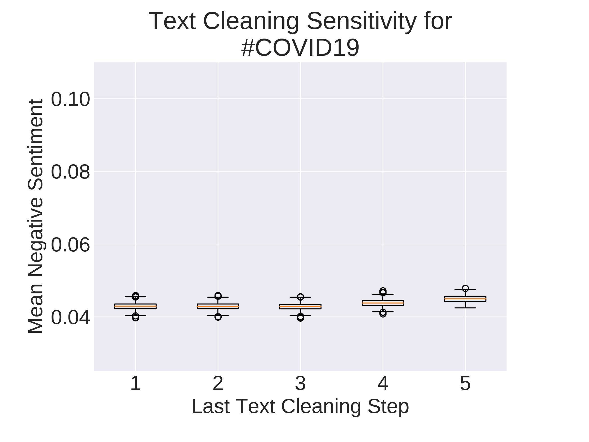
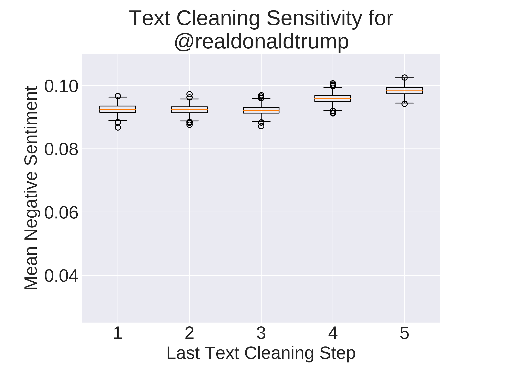
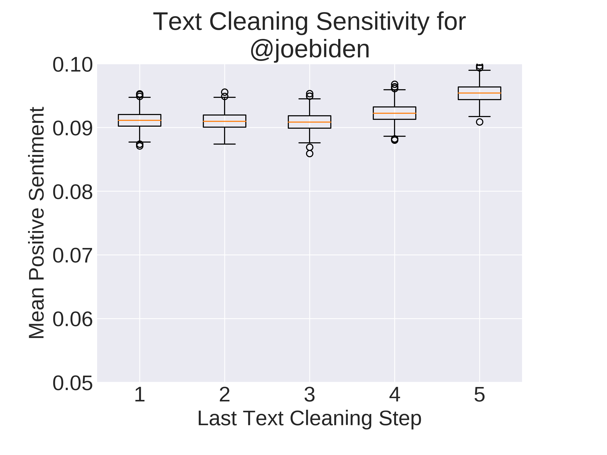
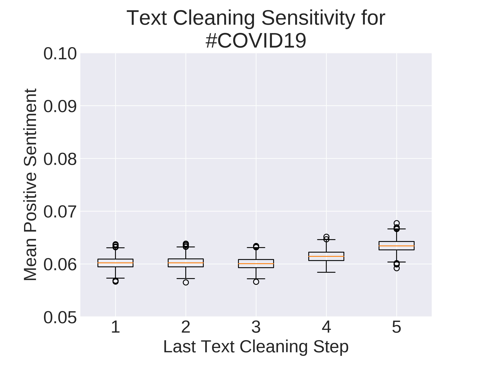
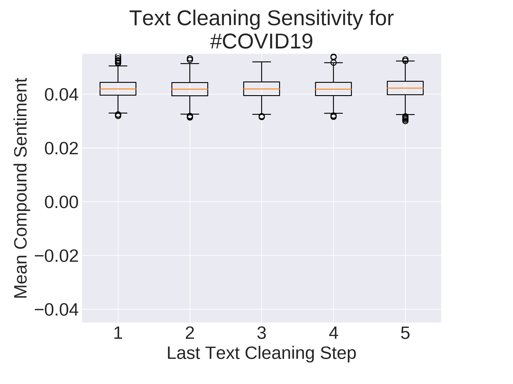
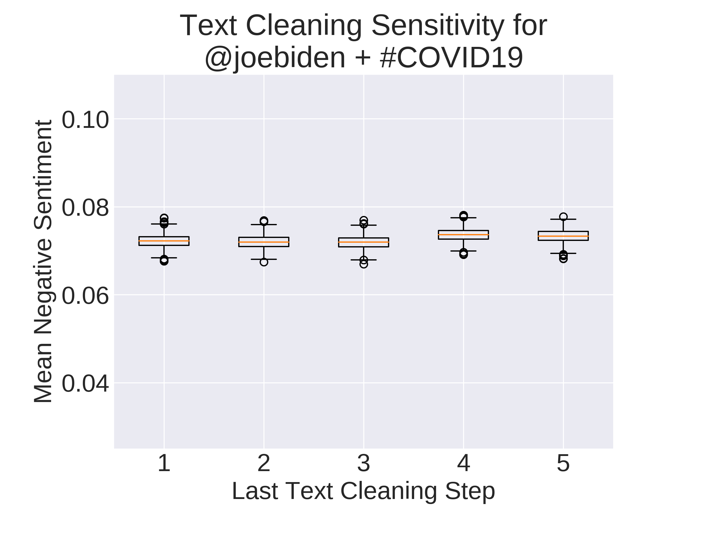
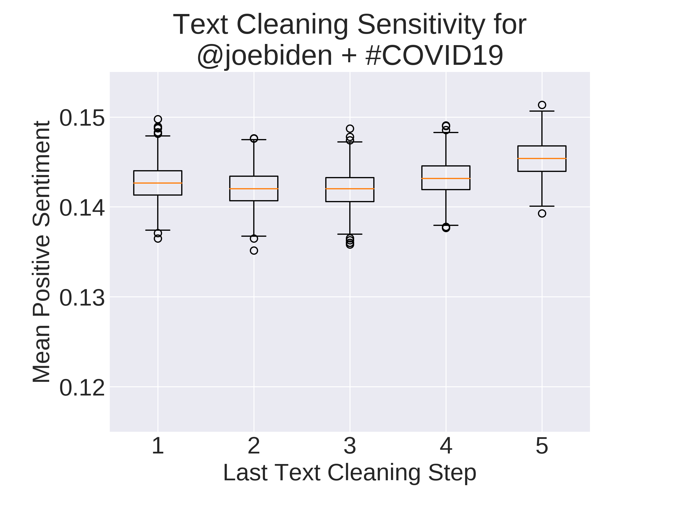
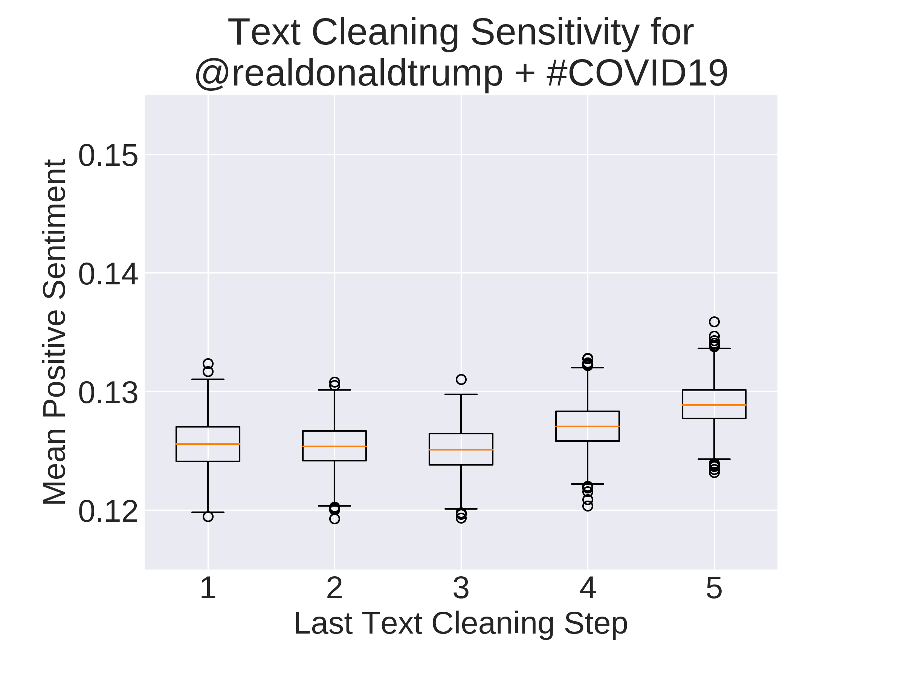

# Sensitivity Analysis of VADER Sentiment Analyzer

<p align="center">
    
</p>


# Table of Contents

1. [Motivation](#Motivation)
2. [The Dataset](#The-Dataset)
3. [Exploratory Data Analysis](#Exploratory-Data-Analysis)
4. [The VADER Algorithm](#The-VADER-Algorithm)
5. [Bootstrapping the Data](##Bootstrapping-The-Data)
6. [Sensitivity of Pre-processing](#Sensitivity-of-Pre-processing)
7. [Conclusion](#Conclusion)
8. [References](#References)


# Motivation
VADER (Valence Aware Dictionary and sEntiment Reader) is a rule-based sentiment analysis tool that is commonly used for social-media sentiment analysis. The meat of VADER is provided by two main resources: the VADER sentiment lexicon and the rule-based sentiment analysis engine.

According to the development [github page](https://github.com/cjhutto/vaderSentiment), the VADER lexicon has been created (and validated) by 10 independent humans who **manually** assign the sentiment value to each word using a [wisdom-of-the-crowd (WotC)](http://comp.social.gatech.edu/papers/icwsm14.vader.hutto.pdf) approach, described briefly below:

>Sentiment ratings from 10 independent human raters (all pre-screened, trained, and quality checked for optimal inter-rater reliability). Over 9,000 token features were rated on a scale from "[–4] Extremely Negative" to "[4] Extremely Positive", with allowance for "[0] Neutral (or Neither, N/A)".  We kept every lexical feature that had a non-zero mean rating, and whose standard deviation was less than 2.5 as determined by the aggregate of those ten independent raters.  This left us with just over 7,500 lexical features with validated valence scores that indicated both the sentiment polarity (positive/negative), and the sentiment intensity on a scale from –4 to +4. For example, the word "okay" has a positive valence of 0.9, "good" is 1.9, and "great" is 3.1, whereas "horrible" is –2.5, the frowning emoticon :( is –2.2, and "sucks" and it's slang derivative "sux" are both –1.5.

Manually assigning (and validating) sentiment for the lexicon enables the sentiment of commonly used emoticons, acronyms and slag words to be accurately determined. 

On top of the lexicon, VADER also uses a rule-based sentiment analysis engine. The idea behind this engine is to encorporate **word-order sensitive relationships** that boil down to these five rules:

1. Punctuation increases the magnitude of the intensity without modyfying the semantic orientation.

        "I'm bored of being stuck at home!!" vs. "I'm bored of being stuck at home"

2. Likewise, capitalization increases the magnitude of the intensity without affecting the semantic orientation.

        "I'm bored of being STUCK AT HOME" vs. "I'm bored of being stuck at home"

3. Degree adverbs either negatively or positively impact sentiment intensity.

        "I'm incredibly bored of being stuck at home" vs. "I'm bored of being stuck at home"

4. The conjunction 'but' signals a shift in sentiment polarity, with the sentiment of the text following the conjunction being dominant.

        "I'm bored of being stuck at home, but my house is clean"

5. The tri-gram preceding a sentiment-laden lexical feature will catch most cases of negation flips in polarity.

        "My house isn't really all that clean"

With both of these attributes, VADER claims to perform excellent on predicting sentiment with social media style corpora. With this project, I wanted to investigate this claim by analyzing the sensitivity of the VADER algorithm to text pre-processing. Text pre-processing is a procedure, or series of procedures, commonly performed in natural language processing (NLP) to improve the performance of machine learning (ML) algorithms. Thus, a deeper understanding of the effect of text pre-preprocessing on VADER sentiment analysis could help future data scientists develop more effective ML algorithms. 

# The Dataset 

I wanted to simulate a data science project from conceptualization to data wrangling through feature engineering. Since the VADER algorithm was trained to perform sentiment analysis on social media documents, I decided to collect Twitter data, tweets, to form my dataset.

## Tweet Collection

The topic I chose to investigate is in the back of everyone's mind at the moment; the COVID-19 pandemic. Being a national emergency, I figured people on twitter would express emotion towards their political leaders concerning the topic. So, tweets were collected using Twitter's free API and the [Tweepy](http://www.tweepy.org/) python library in three distinct geopolitical regions in the contigous United States: Oregon, Colorado, and Arkansas. These regions were chosen via their representation in the [U.S. Senate](https://en.wikipedia.org/wiki/United_States_Senate); Oregon - Liberal, Colorado - Bipartisan, and Arkansas - Conservative. Keeping with the political focus, tweets were streamed with the following keyword combinations:

1. @joebiden
2. @joebiden & #COVID19
3. #COVID19
4. @realdonaldtrump & #COVID19
5. @realdonaldtrump

For each of these keyword combinations, ~8,000 tweets were collected in a 6 day period from 3/31/2020 to 4/6/2020 for each region; totaling ~ 120,000 tweets. Due to the request rate limitation of the Twitter API, I rotated through keywords after collecting ~1,000 tweets. The tweets were stored in their natural, unstructured state and aggregated. Tweets are naturally structured as nested json files with many attributes. Here's an example of a relatively short tweet (truncated for brevity):

<p align="center">
    
    
</p>


As you can see, that 'short' tweet is not so short. To put the data in a more structured format, the tweets were queried for select fields and stored in a local pandas DataFrame prior to processing. The structure of a flattened pandas DataFrame is shown below:

<p align="center">
    
</p>

Most of the fields mentioned above were gathered for future projects; fields relevant for this project are **tweet_text, state, and search_term_key.**

## Data Pipeline

<p align="center">
    
</p>

As mentioned in the introduction, throughout this project I wanted to simulate a 'big data' corporate data science project. In big data projects it is almost impossible to process all the data locally. As such the data stack I decided on is depicted in the figure above. 

First, the tweets were streamed to a remote AWS EC2 instance (t2.micro). The tweets were then stored in unstructured format in an AWS s3 bucket to await analysis. [Apache SparkSQL](https://spark.apache.org/) was used to cast the unstructured json to a dataframe for use locally with the [pandas](https://pandas.pydata.org/) python library. 


# Exploratory Data Analysis 
## The Centennial State

To get a better understanding of the data, I explored the corpus of tweets gathered from the Colorado region. 

<p align="center">
    
    
</p>

Figure 1: Top 25 most used words by search term of unprocessed tweet text. Relative frequency of each word is shown for single-word search terms (left) and double-word search terms (right).

Overall, single-word search term corpora have a smaller number of very popular words than those from double-word search terms. Unsurprisingly, the search term appeared in the top 5 most frequently used words in their data set. Somewhat more suprising, was the prevalence of small, relatively uninformative words, such as 'to', 'the' and 'is', in all of the data sets. 

However, what I found to be the most interesting was the lack of search terms in each of the double-word datasets as well as the similarity between them. In fact, they share 24/25 top words.

The similarity between the word frequency charts made me skeptical that there would be any noticable difference in sentiment between the two treatments. But never say never.

# The VADER Algorithm 

To explore the data further, I wanted to see how the 'raw' data would perform with the VADER algorith. For reference, here are some examples provided on their GitHub page:

```pthyon
VADER is smart, handsome, and funny.----------- {'pos': 0.746, 'compound': 0.8316, 'neu': 0.254, 'neg': 0.0}
VADER is VERY SMART, handsome, and FUNNY!!!---- {'pos': 0.767, 'compound': 0.9342, 'neu': 0.233, 'neg': 0.0}
VADER is not smart, handsome, nor funny.------- {'pos': 0.0, 'compound': -0.7424, 'neu': 0.354, 'neg': 0.646}

The book was good.----------------------------- {'pos': 0.492, 'compound': 0.4404, 'neu': 0.508, 'neg': 0.0}
At least it isn't a horrible book.------------- {'pos': 0.363, 'compound': 0.431, 'neu': 0.637, 'neg': 0.0}

Today only kinda sux! But I'll get by, lol----- {'pos': 0.317, 'compound': 0.5249, 'neu': 0.556, 'neg': 0.127}
Make sure you :) or :D today!------------------ {'pos': 0.706, 'compound': 0.8633, 'neu': 0.294, 'neg': 0.0}
Catch utf-8 emoji such as 💘 and 💋 and 😁------ {'pos': 0.279, 'compound': 0.7003, 'neu': 0.721, 'neg': 0.0}

Not bad at all--------------------------------- {'pos': 0.487, 'compound': 0.431, 'neu': 0.513, 'neg': 0.0}

```

From the examples, this algorithm should fair pretty well with out data - let's see.

<p align="center">
    
</p>

<p align="center">
    
</p>

<p align="center">
    
</p>

Figure 2. Histograms of VADER Compound Sentiment by single-word search. Compound sentiment is scaled from [-1, 1]. It's calculated by weighting the positive sentiment, negative sentiment and neutral sentiment proportions along with corrections for phrases.

From the above figure, there seem to be a very large number tweets that have close to zero compound sentiment. Of those tweets that are laden with sentiment - they are bifurcated into eith positive or negative. . Not very helpful when trying to analyze sentitivity. 

# Bootstrapping The Data

The initial data seemed kind of messy. I chose to bootstrap sample the VADER scores to try to get more infrmation out of it. 

<p align="center">
    
</p>

<p align="center">
    
</p>

Success!! Although the distribution of compound sentiment by itself was uninteresting - bootstrapping our sample allowed us to see differences between the groups. 

The overall difference in the sample means is relatively small compared to the scale range; however, when zooming in the difference is stark.

The single-term search datasets scored well below the double-term search datasets. Seems like those people who tweet about COVID-19 and their presidential leader are more pleased than the single-term tweeters. 


# Sensitivity of Pre-processing

Text preprocessing is a crucial step when performing any king of machine learning (ML) task. There are many ways to clean text, but traditionally they boil down to these:

1. Lowercase the text
2. Eliminate cultural abbreviations
4. Eliminate grammatical abbreviations
4. Remove punctuation
5. Remove non-text characters

I repeated the bootstrapped analysis above but with incrementally increasing the amount of text pre-processing. I wanted to see if the VADER results change for the better after pre-processing.

<p align="center">
    
    
    
</p>
<p align="center">
    
    
    
</p>
<p align="center">
    
    
    
</p>

In the above Figure, search terms are varied with columns and VADER metric is varied with rows. First thing I noticed was the lack of overall change in sentiment parameter with increasing text preprocessing. However, the relative change is noticable - especially on the distribution of sample means.

For example, it seems both Joe Biden and Donald Trump have higher negative AND positive sentiment proportions on average; but, both of their compound sentiment scores decreased.  


<p align="center">
    
    
</p>
<p align="center">
    
    
</p>
<p align="center">
    
    
</p>

Following a similar trend - as preprocessing increases negative and positive proportions for dual-word search terms increase; while compound score decreases. 

It seems like the majority of the change in compound sentiment occures when removing non-character characters - such as emojis. Intuitavely, this makes sense - emoji's are compact expressions of emotion. 

# Conclusion

In conclusion, the VADER algorithm is impacted by text preprocessing techniques. The scope of this impact is for another project, but it is important to realize how you preprocess data can have remifications!

In the future, I would like to continue this analysis across state lines and dive deeper into the tweets themselves to manually guage the sentiment of the tweets myself!

Hope you enjoyed the read.

Thank you - Connor

# References:
1. [VADER github](https://github.com/cjhutto/vaderSentiment)
2. [VADER research publication](http://comp.social.gatech.edu/papers/icwsm14.vader.hutto.pdf)
3. [Tweepy](http://www.tweepy.org/)
4. [U.S. Senate](https://en.wikipedia.org/wiki/United_States_Senate)
5. [Apache SparkSQL](https://spark.apache.org/)
6. [pandas](https://pandas.pydata.org/)
